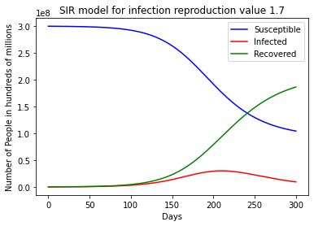
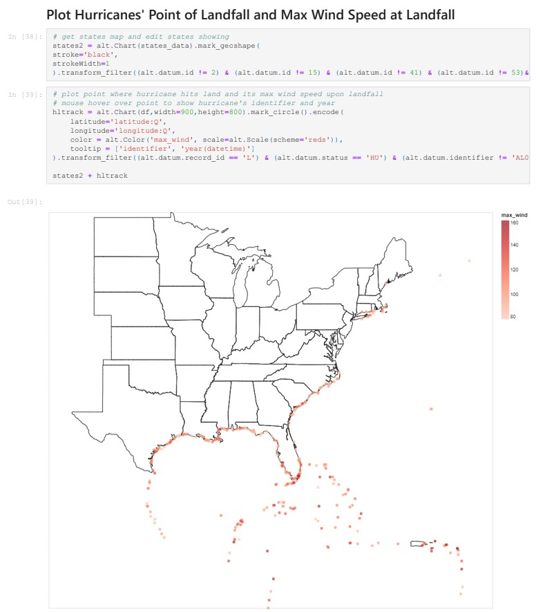

# Nathan R. Rice
*Data Scientist*

## Education
* Bachelors of Science (Data Science), Masters of Science (Data Science Accelerated BS/MS), *University of Massachusetts Dartmouth*, 2019-2022

# [Project 1: NBA Daily Fantasy](https://github.com/NateRice/NBADailyFantasy)
## Topic: Sports Analytics

Photo by <a href="https://unsplash.com/@tjdragotta?utm_source=unsplash&utm_medium=referral&utm_content=creditCopyText">TJ Dragotta</a> on <a href="https://unsplash.com/s/photos/nba?utm_source=unsplash&utm_medium=referral&utm_content=creditCopyText">Unsplash</a>
  

This project is an optimization tool for NBA daily fantasy, specifically DraftKings roster selection. The project includes player/team analysis and visualization for the purpose of optimizing DraftKings lineups.
* **Programming Language:** Python
* **Python libraries used:** Pandas, MatPlotLib
* **Input:** stats.nba.com, DraftKings, espn.com
* **Output:** Player Dataframes, player-per-game floor-avg-ceiling plots

# [Project 2: "Flattening the Curve": How to stop the spread of infectious diseases such as the coronavirus](https://github.com/NateRice/flattening_the_curve)
## Topic: Scientific Computing
!  [alt text](rnot10.png)

Visualization of the coronavirus "flattening of the curve" based on the SIR model of disease spread used in the study of epidemiology. Coded in Python using pyplot and numpy
* **Programming Language:** Python
* **Python libraries used:** pyplot, numpy
* **Input:** number of infections on day 0 - March 29 2020, typical recovery time in hours, total population of the United States
* **Output:** SIR model plots

# [Project 3: Hurricane Data Analysis & Visualization](https://github.com/NateRice/hurricane)
## Topic: Data Analytics and Visualization

Data analysis and visualization of historical hurricane data using python
* **Programming Language:** Python
* **Python libraries used:** pandas, pyplot, numpy, altair
* **Input:** historical hurricane dataset
* **Output:** visualizations
